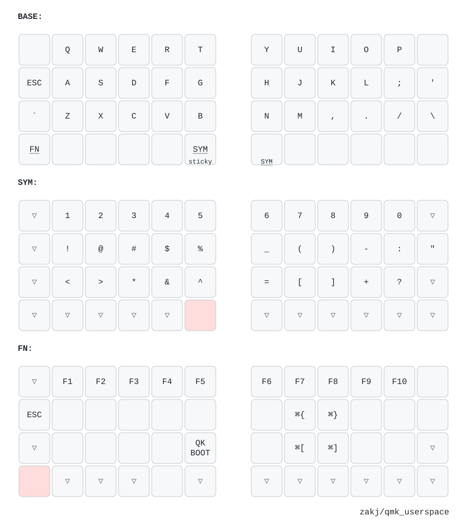

# QMK userspace for Keebio Nyquist LM

Needs [mise](https://mise.jdx.dev) and Docker. `mise run setup` clones
`qmk_firmware` alongside this repo; everything else runs in the `qmk_cli`
container against it.

| Task | |
| --- | --- |
| `mise run compile` | build firmware for every target in `qmk.json` |
| `mise run draw` | regenerate the diagrams in `keymap-drawer/` |
| `mise run fmt` | grid-align the `LAYOUT()` blocks |
| `mise run shell` | interactive container with both trees mounted |
